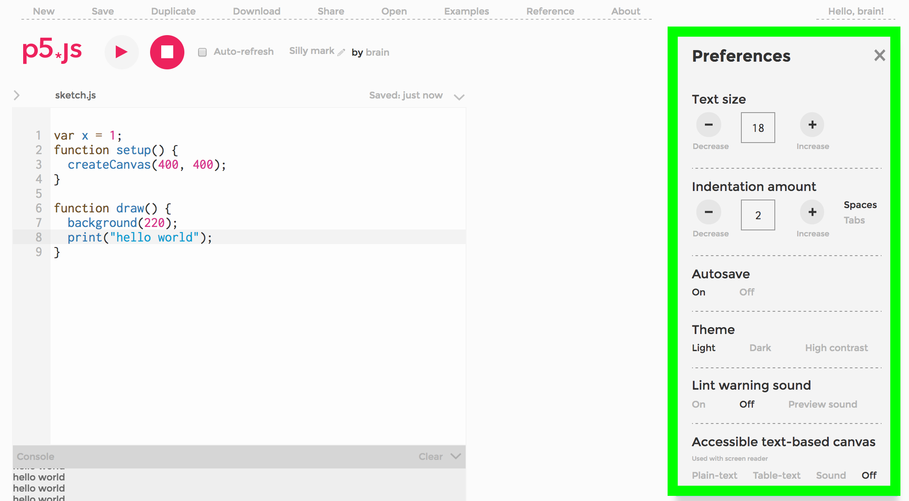

#P5JS Editor Walk-through

This is a brief walk-through of the p5 web editor. 

The p5 web editor allows for p5 sketches to be created, edited and saved in the browser. Sketches are saved to user accounts and can be viewed publicly. Media files such as images and sound can be uploaded for use in sketches. Files must be smaller than 5mb.

The p5 editor is in an alpha phase of development. Please report any bugs or issues you find to us [here.](https://github.com/processing/p5.js-web-editor/issues) 

##Main Menu

- The main navigation menu is where you can start a new sketch, save and open your old sketches. There are also links to examples and the p5 reference page.

- After a sketch is saved, this menu expands with duplucate, download and share.

- SAVE: Saves the sketch to your account and assigns it a unique URL. This unique URL makes it easy to share homework or class examples and is defined by the unique identifier number at the end of the URL. Each sketch is also assigned a two word default name that can be changed.
- Each sketch will be saved to your account with the date.
- DUPLICATE: Duplicates a user's sketch to your account where you can edit the code. All p5 sketches are public, however only the owner of the sketch can edit. 
- DOWNLOAD: Downloads a zip of your sketch to your computer. The p5 library and any other javascript libraries in use are not included but linked to online CDN versions (in the index.html file). 
- SHARE: This gives options to share your sketch in other places. Embed code allows for the sketch to be embed as an iframe in another website. Fullscreen gives a link to the fullscreen version of your sketch. Edit takes you to the editor page of your sketch.
- OPEN: Opens previously saved p5 sketches.
- EXAMPLES: Loads the examples from the p5js website.
- REFERENCE: Links to reference page of p5js website.
- ABOUT: Helpful links

##Editing Window

- The editing window is where the code is written and edited. 
- The play and stop buttons execute and stop your code. When you press play your sketch output will be shown in the display window to the right.
- If the auto-refresh checkbox is checked, the output will be updated with every change made. The default is to have this unchecked, and then the output will only update if you press the play button.
- The dropdown arrow on the top right of the editing window is where you can autoformat your code. There is also a link here to the keyboard shortcuts for the editor.

- The console is where error and print commands are displayed and is modeled on the Chrome javascript console.

##Project Folder

- The project folder is found by clicking the arrow next to the filename (usually sketch.js at the top of the editing window). The project folder is where the file structure pane of your p5 sketch can be viewed. This is where you can toggle between the sketch.js, index.html and style.css files to edit these.

- The first dropdown arrow is where you can add in extra files such as additional libraries. You can also arrange your code into folders. 

- The second dropdown arrow is where you can rename or delete files. 

##Adding Libraries

- There are three ways to use extra libraries in your sketch. 
 	- In the index.html file, add links to the online [CDN versions](http://www.jsdelivr.com/) of the library
	- Use the first dropdown arrow in the project folder and select add file. Drag and drop your libary files in the popup.
	- Using the same popup, a new empty file can be created. You can type/paste your library code there.

##Preferences

- Preferences is located at the cog to the top right of the screen. 

- The preference menu is where the themes, text sizes, sounds and accessibility settings can be changed. Accessibility features are being developed for p5 to improve usability for people with low vision.

